# 💎 TeleTopaz — 技術規格文件

> **版本**：0.3.0
> **最後更新**：2026-03-18
> **語言 / 框架**：TypeScript (ES2022) · Node.js 22+ · ESM

---

## 目錄

1. [概觀與系統需求](#1-概觀與系統需求)
2. [架構總覽](#2-架構總覽)
3. [啟動流程](#3-啟動流程)
4. [核心機器人邏輯](#4-核心機器人邏輯)
5. [會話管理](#5-會話管理)
6. [會話韌性與復原](#6-會話韌性與復原)
7. [AI 供應商整合](#7-ai-供應商整合)
8. [PTY 模組](#8-pty-模組)
9. [智慧路由 (Auto Mode)](#9-智慧路由-auto-mode)
10. [安全機制](#10-安全機制)
11. [Telegram 整合](#11-telegram-整合)
12. [設定管理](#12-設定管理)
13. [工具程式與輔助模組](#13-工具程式與輔助模組)
14. [常數與限制](#14-常數與限制)
15. [熱重啟與自動退版](#15-熱重啟與自動退版)
16. [版本變更紀錄](#16-版本變更紀錄)

---

## 1. 概觀與系統需求

### 1.1 專案簡介

TeleTopaz 是以 TypeScript 實作的進階 AI 代理 Telegram 機器人，支援 **GitHub Copilot SDK** 與 **Google Gemini CLI** 雙供應商。核心特色包括：

- **雙供應商支援**：同時整合 GitHub Copilot 與 Google Gemini，可依需求自由切換
- **智慧路由 (Auto Mode)**：自動分析使用者意圖，簡單查詢使用輕量模型 (Router)，複雜任務切換至強力模型 (Core)
- **安全持久化記憶**：以工作區為作用域保存最近對話脈絡，寫入前自動遮罩敏感資訊
- **安全沙盒**：在 macOS 上透過 `sandbox-exec` 隔離執行環境
- **人機協作護欄**：敏感操作需使用者即時按鈕確認
- **隱私優先**：內建敏感資訊遮蔽 (Redaction) 與 Prompt Injection 防護

### 1.2 系統需求

| 項目 | 需求 |
|------|------|
| Node.js | 22+ |
| 作業系統 | macOS（推薦，支援沙盒與 Keychain）或 Linux |
| Copilot | 需具備 GitHub Copilot 訂閱 |
| Gemini | 需安裝並設定 `gemini` CLI 工具（選用） |

### 1.3 相依套件

| 套件 | 用途 |
|------|------|
| `@github/copilot-sdk` | Copilot AI 供應商整合 |
| `node-pty` | Gemini PTY 工作階段（偽終端機） |
| `fast-glob` | 目錄模式展開 |
| `keytar` | macOS Keychain 存取 |
| `sharp` | 圖片重新編碼（JPEG） |
| `vitest` | 測試框架 |
| `typescript` | TypeScript 編譯器 |
| `tsx` | TypeScript 直接執行（用於 setup 腳本） |

### 1.4 專案結構

```
TeleTopaz/
├── src/
│   ├── index.ts              # 進入點
│   ├── bot.ts                # 機器人核心邏輯 (~2,723 行)
│   ├── config/
│   │   ├── models.ts         # 模型定義與格式化
│   │   ├── directories.ts    # 目錄存取控制
│   │   ├── secrets.ts        # 密鑰管理
│   │   └── runtime-config.ts # 執行時設定持久化
│   ├── session/
│   │   ├── state.ts          # 會話狀態型別定義
│   │   ├── persona.ts        # 人設提示詞建構
│   │   ├── memory-store.ts   # 持久化會話記憶
│   │   ├── prompt.ts         # 提示詞組裝與分段
│   │   └── emoji.ts          # 會話圖示池
│   ├── provider/
│   │   └── types.ts          # AI 供應商抽象介面
│   ├── copilot/
│   │   └── sdk.ts            # Copilot SDK 封裝
│   ├── gemini/
│   │   ├── sdk.ts            # Gemini CLI 封裝（stream-json）
│   │   └── pty-session.ts    # Gemini PTY 工作階段封裝
│   ├── claude/
│   │   └── sdk.ts            # Claude Code CLI 封裝
│   ├── pty/
│   │   ├── index.ts          # PTY 模組匯出
│   │   ├── runner.ts         # PTY 執行器
│   │   ├── session-manager.ts# 工作階段管理（崩潰重建）
│   │   ├── ansi-parser.ts    # ANSI 清除與回應擷取
│   │   ├── completion-detector.ts # 完成偵測
│   │   ├── human-typist.ts   # 擬人化輸入
│   │   ├── sanitizer.ts      # PTY 輸入安全檢查
│   │   ├── request-queue.ts  # 請求佇列
│   │   └── session-pacer.ts  # 工作階段步調控制
│   ├── guardrails/
│   │   ├── guardrails.ts     # 護欄引擎
│   │   ├── builtin.ts        # 內建安全規則
│   │   └── types.ts          # 護欄型別定義
│   ├── telegram/
│   │   ├── api.ts            # Telegram Bot API 封裝
│   │   └── types.ts          # Telegram 型別定義
│   ├── services/
│   │   └── quota.ts          # 用量配額追蹤
│   ├── restart.ts            # 熱重啟與退版邏輯
│   ├── sandbox.ts            # 沙盒啟動邏輯
│   ├── sandbox-profile.ts    # 沙盒設定檔生成
│   └── util/
│       ├── logger.ts         # 日誌系統
│       ├── errors.ts         # 錯誤分類與去重
│       ├── format.ts         # 顯示格式化
│       ├── markdown.ts       # Markdown → Telegram 轉換
│       ├── redaction.ts      # 敏感資料遮蔽
│       ├── tls.ts            # TLS 憑證釘選
│       ├── images.ts         # 圖片處理
│       └── app-data.ts       # App Data 目錄解析
├── tests/                    # 35 個測試檔案
├── scripts/
│   ├── launcher.js           # 熱重啟 Launcher
│   └── setup-secrets.ts      # 密鑰設定精靈
├── assets/                   # 靜態資源
├── logs/                     # 日誌輸出
├── dist/                     # 編譯輸出
├── package.json
├── tsconfig.json
└── vitest.config.ts
```

---

## 2. 架構總覽

### 2.1 系統架構圖

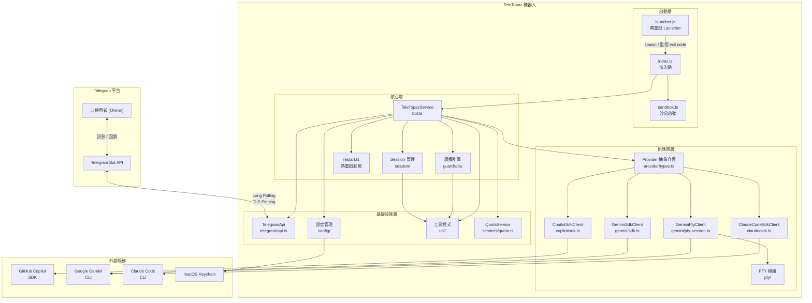

### 2.2 資料流圖

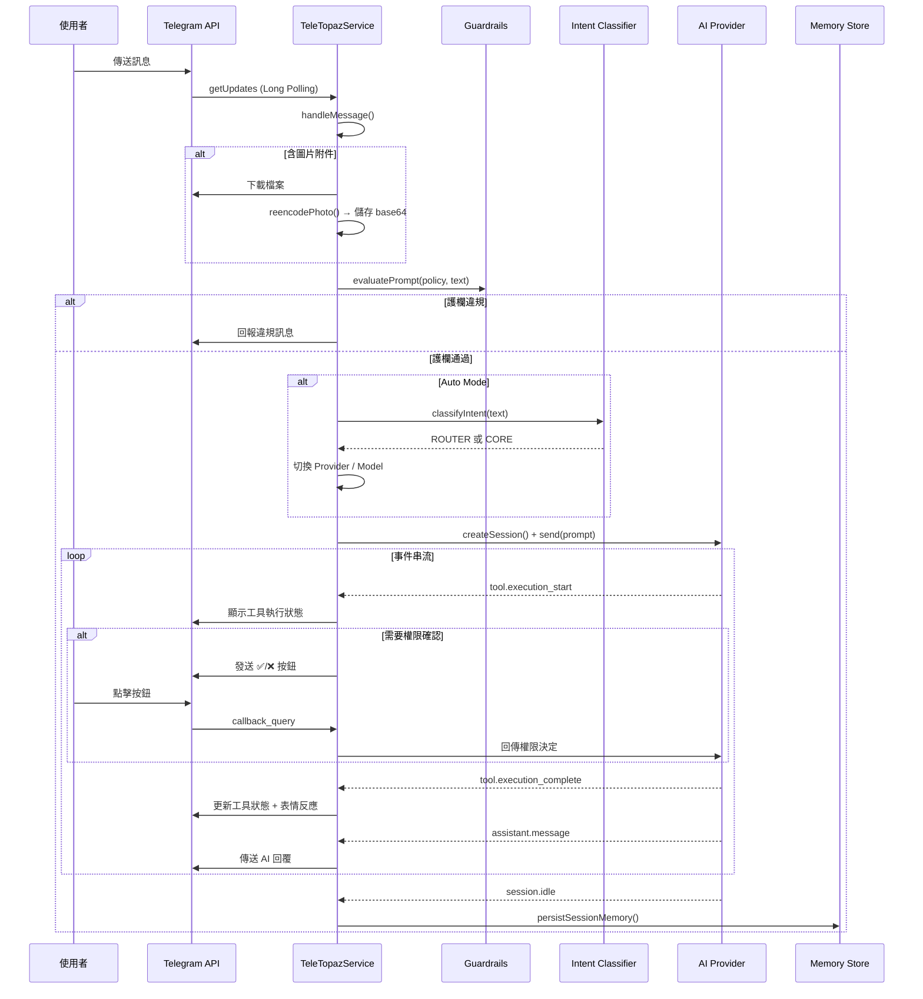

### 2.3 模組依賴圖

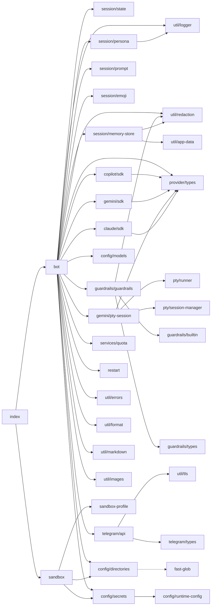

---

## 3. 啟動流程

### 3.1 進入點

#### Launcher (`scripts/launcher.js`)

`npm start` 透過 Launcher 啟動服務，支援熱重啟循環：

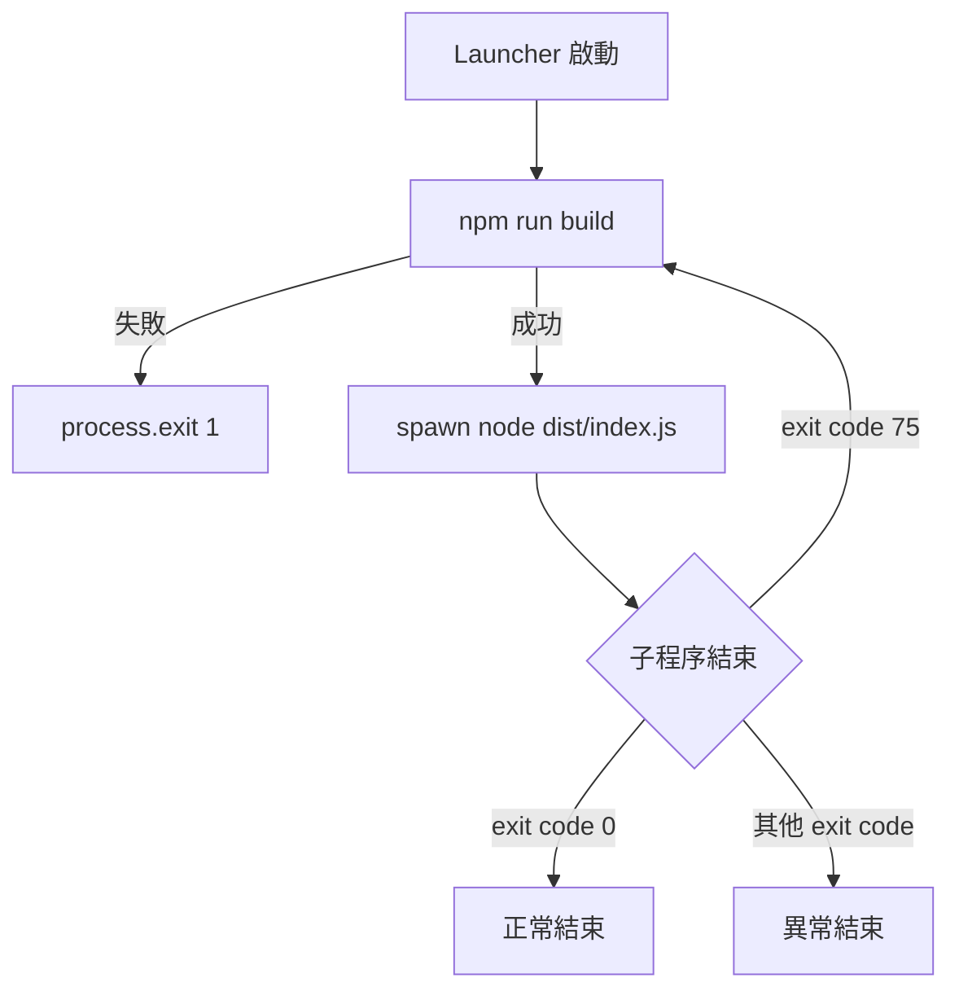

#### Bot 進入點 (`src/index.ts`)

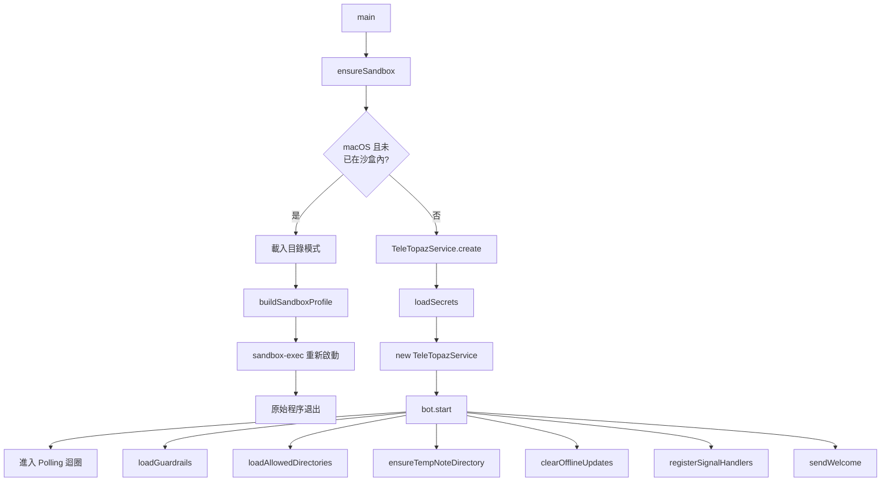

### 3.2 密鑰載入優先順序

1. **環境變數** — `TELETOPAZ_BOT_TOKEN` / `TELETOPAZ_OWNER_CHAT_ID` / `TELETOPAZ_OWNER_USER_ID`
2. **macOS Keychain** — 服務名稱 `teletopaz`，鍵名 `bot_token` / `owner_chat_id` / `owner_user_id`
3. **失敗** — 若兩者皆缺，拋出錯誤並終止

### 3.3 沙盒啟動條件

| 條件 | 說明 |
|------|------|
| `process.platform === "darwin"` | 僅 macOS 支援 |
| `!isSandboxActive()` | 尚未在沙盒環境中 |
| `isSandboxEnabled()` | 永遠回傳 `true`（無法透過環境變數停用） |
| `TELETOPAZ_DIRECTORY_PATTERNS` 非空 | 至少一個可寫入目錄 |

---

## 4. 核心機器人邏輯

### 4.1 TeleTopazService 類別

**檔案**：`src/bot.ts` (~2,723 行)  
**職責**：訊息處理、指令路由、事件分發、工具權限管理、會話生命週期管理、會話韌性復原

#### 4.1.1 靜態工廠方法

```typescript
static async create(): Promise<TeleTopazService>
```

載入密鑰後建構 `TeleTopazService` 實例，初始化 `TelegramApi`。

#### 建構子

```typescript
constructor(api: TelegramApi, ownerChatId: string, ownerUserId: string, startTimestamp: number)
```

- `startTimestamp` 為 `Math.floor(Date.now() / 1000)`，用於過濾啟動前殘留的 Telegram 指令（`/restart`、`/quit`）與回調（`callback_query`），避免處理離線期間的陳舊事件。

#### 4.1.2 核心生命週期

| 方法 | 說明 |
|------|------|
| `start()` | 載入護欄、目錄、模型；建立 TempNote 預設工作區；清除離線更新；發送歡迎訊息；開始 polling |
| `poll()` | 無限迴圈呼叫 `getUpdates(offset, 25)`；每輪執行 `checkSessionHealth()`；處理每個 update |
| `shutdown()` | 設定關閉旗標；銷毀所有 session (6s 逾時)；停止所有 client (4s 逾時)；flush 日誌 (4s 逾時)；`process.exit(0)` |
| `shutdownForRestart()` | 同 `shutdown()` 但以 `process.exit(75)` 結束，觸發 Launcher 重建重啟 |

### 4.2 訊息處理流程

#### 4.2.1 `handleMessage(message)`

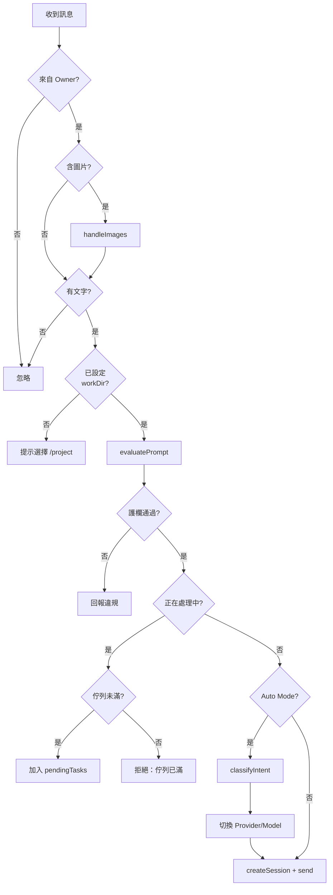

#### 4.2.2 圖片處理

| 限制 | 值 |
|------|-----|
| 最大附件數 | 8 張 |
| 單檔大小限制 | 8 MB |
| 重新編碼格式 | JPEG, 80% 品質, mozJPEG |
| 儲存格式 | `data:image/jpeg;base64,...` |

#### 支援的圖片 MIME 類型

```typescript
const MIME_EXTENSIONS: Record<string, string> = {
  "image/jpeg": "jpg",
  "image/png": "png",
  "image/gif": "gif",
  "image/webp": "webp",
  "image/bmp": "bmp",
  "image/svg+xml": "svg",
};
```

#### 磁碟儲存

當 `state.workDir` 存在時，附件會同時儲存至磁碟以便 AI 工具直接讀取：

- 儲存路徑：`{workDir}/attachments/photo_{timestamp}_{index}.{ext}`
- 副檔名由 `MIME_EXTENSIONS` 映射，未知類型使用 MIME 子類型或 `bin`
- 儲存失敗時不中斷流程，退回 `dataUrl` 方案

#### 4.2.3 提示詞佇列

- 最大佇列長度：`PENDING_LIMIT = 15`
- 當 session 進入 `session.idle` 時自動處理下一個佇列任務
- 佇列任務包含 `{ prompt, queuedAt }` 時間戳

### 4.3 指令系統

| 指令 | 回調鍵 | 處理方法 | 說明 |
|------|--------|----------|------|
| `/help` | `do.help` | `sendWelcome()` | 顯示說明與指令列表 |
| `/project` | `do.project` | `sendDirectoryList()` | 選擇專案 |
| `/newproject` | — | `handleNewProject()` | 在工作區建立新專案目錄 |
| `/model` | `do.model` | `handleModelCommand()` | 設定 AI 模型與路由模式 |
| `/info`, `/i` | `do.info` | `sendStatus()` | 檢視狀態、模型、用量 |
| `/clear` | — | `handleClear()` | 清除對話歷史與附件 |
| `/allowall` | — | `handleAllowAllToggle()` | 切換工具執行自動批准模式 |
| `/silent` | — | `handleSilentToggle()` | 切換安靜模式（工具狀態折疊至單一訊息） |
| `/router` | — | `handleRouterCommand()` | 以 routerModel 執行單次對話並自動還原狀態 |
| `/restart` | — | `handleRestart()` | 熱重啟服務（需 Launcher） |
| `/quit` | — | `shutdown()` | 安全關閉機器人 |

> **陳舊事件過濾**：`/restart` 與 `/quit` 指令及所有 `callback_query` 會檢查訊息日期是否 ≥ `startTimestamp`，以過濾離線期間堆積的事件。

#### 4.3.1 `/newproject` 指令規格

**語法**：`/newproject {project_name}`

**處理方法**：`handleNewProject(chatId, name)`

**流程**：
1. 檢查 `state.workDir` 是否已設定（未設定則提示先用 `/project` 選擇專案）
2. 驗證名稱合法字元：僅允許 `[a-zA-Z0-9_-]`，長度 1–64
3. 計算目標路徑：`path.dirname(state.workDir)` + `name`（工作區路徑 + 新專案名稱）
4. 檢查目標路徑是否已存在
5. 建立目錄：`fs.mkdir(targetPath, { recursive: true })`
6. 回應成功或錯誤訊息

**錯誤訊息**：
| 情況 | 訊息 |
|------|------|
| 未選擇專案 | `請先使用 /project 選擇專案。` |
| 名稱為空 | `❌ 請提供專案名稱（例：/newproject MyApp）。` |
| 名稱不合法 | `❌ 專案名稱僅允許英數字、底線與連字號（1–64 字元）。` |
| 目錄已存在 | `❌ 專案 {name} 已存在。` |
| 系統錯誤 | `❌ 建立專案失敗：{error.message}` |

**安全考量**：
- 名稱限制 `[a-zA-Z0-9_-]` 防止路徑穿越（不允許 `.`、`/`、`\`）
- 建立後不自動切換到新專案
- 無需導航按鈕（指令需帶參數）

#### 4.3.2 `/silent` 指令規格

**語法**：`/silent`

**處理方法**：`handleSilentToggle(chatId)`

安靜模式（`silentMode`，預設 `true`）開啟時，工具執行狀態不各自發送獨立訊息，而是折疊至單一「錨點訊息」（`silentAnchorMessageId`）並持續編輯更新。

| 狀態 | `silentMode = true` | `silentMode = false` |
|------|---------------------|----------------------|
| 工具開始 | `silentSend()` 更新/建立錨點訊息 | `safeSend()` 發送獨立訊息 + 按鈕 |
| 工具完成 | 編輯錨點訊息（無按鈕） | 編輯個別訊息（含按鈕） |
| Done 通知 | `silentSend()` 更新錨點 | `editMessageSafe()` 編輯 processingMessageId |

- `silentSend(chatId, text, replyTo?)` — 首次呼叫（無錨點）發送新訊息；後續呼叫編輯錨點
- 清除錨點的時機：`preparePromptDispatch()`（新一輪對話）與 `handleClear()`
- 切換為「關閉」時同時清除 `silentAnchorMessageId`

#### 4.3.3 `/router` 指令規格

**語法**：`/router {prompt}`

**處理方法**：`handleRouterCommand(chatId, text)`

以 `routerModel` 執行單次對話後自動還原至原本的 `model`：

1. 暫存目前 `state.model`
2. 切換 `state.model` 為 `state.routerModel`
3. 執行 `sendPreparedPrompt()`
4. `session.idle` 後還原 `state.model`

> **用途**：無需切換模型即可快速詢問 Router 模型一個問題。

### 4.4 事件分發

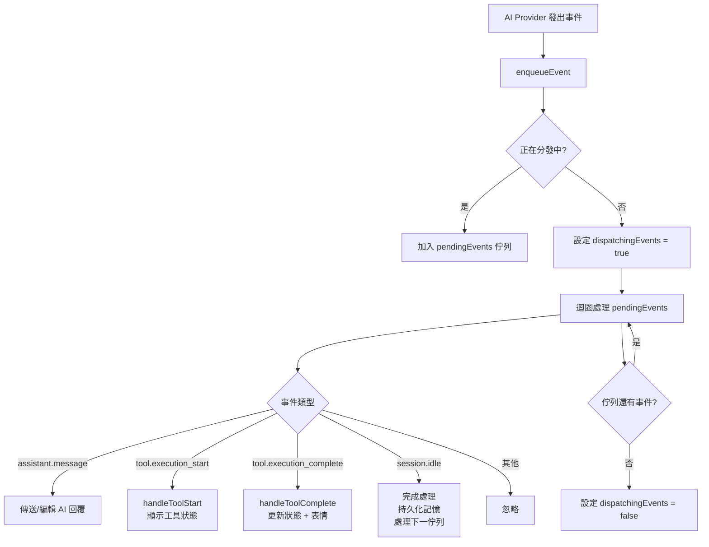

#### 事件型別

| 事件 | 說明 |
|------|------|
| `assistant.message` | AI 最終回覆文字 |
| `assistant.message_delta` | 串流增量（目前忽略） |
| `tool.execution_start` | 工具開始執行 |
| `tool.execution_complete` | 工具執行完成 |
| `session.idle` | 會話閒置 |

### 4.5 工具執行追蹤

每次工具執行會建立 `ToolTracking` 記錄：

```typescript
type ToolTracking = {
  messageId: number     // Telegram 狀態訊息 ID
  resultKey: string     // 結果儲存鍵（UUID）
  paramsKey: string     // 參數儲存鍵（UUID）
  toolName?: string     // 工具名稱
  callId?: string       // 呼叫識別碼
}
```

- 工具狀態以 Telegram 訊息顯示，附帶 inline 按鈕可查看參數/結果
- 完成後以表情反應標記：✅ 成功 / ❌ 失敗
- 若遇 `REACTION_INVALID` 錯誤，會重新取得可用表情清單

### 4.6 回調查詢路由

| 回調 Data | 處理 |
|-----------|------|
| `do.project` | 顯示目錄列表 |
| `do.model` / `do.model:{sub}` | 模型選擇 UI（子路由含 `auto`, `config_router`, `config_core`） |
| `do.info` | 顯示狀態 |
| `do.help` | 顯示說明 |
| `pick.proj:{idx}` | 設定工作目錄 |
| `pick.mod:{idx}` | 設定模型（手動模式） |
| `do.model:pick.manual:{idx}` | 設定模型（手動模式，統一 UI，`do.model:` 子路由） |
| `do.model:pick.router:{idx}` | 設定 Router 模型（`do.model:` 子路由） |
| `do.model:pick.core:{idx}` | 設定 Core 模型（`do.model:` 子路由） |
| `peek.arg:{key}` | 查看工具參數 |
| `peek.res:{key}` | 查看工具結果 |
| `tool.confirm:{id}` | 批准工具執行 |
| `tool.deny:{id}` | 拒絕工具執行 |
| `recovery.resend:{id}` | 重送被動復原暫存的原訊息 |
| `recovery.cancel:{id}` | 取消重送原訊息 |
| `restart.confirm` | 確認熱重啟後服務正常 |
| `restart.deny` | 要求退版重啟 |

---

## 5. 會話管理

### 5.1 AgentContext 狀態結構

**檔案**：`src/session/state.ts`

```typescript
type AgentContext = {
  // 基本
  chatId: number
  provider: ProviderType              // "copilot" | "gemini" | "claude-code"
  client: AiClient | undefined
  session: AiSession | undefined

  // 工作區
  workDir: string | undefined

  // 模型選擇
  model: string | undefined
  mode: "manual" | "auto"
  routerModel: string | undefined     // Auto Mode 快速模型
  coreModel: string | undefined       // Auto Mode 強力模型

  // 處理狀態
  processing: boolean
  pendingTasks: PendingTask[]          // 最多 15 筆
  resetting: boolean

  // 附件
  attachments: Attachment[]            // 最多 8 張

  // UI 狀態
  sessionIcon: string                  // 從 ICON_POOL 選取
  activePrompt: string | undefined
  toolMessageMap: Map<string, ToolTracking>
  awaitingReply: boolean
  completionPending: boolean
  pendingEvents: AiEvent[]
  dispatchingEvents: boolean
  replyToMessageId: number | undefined
  processingMessageId: number | undefined
  processingTimer: NodeJS.Timeout | undefined
  receivedAssistantMessage: boolean
  lastAssistantMessageHash: string | undefined
  lastAssistantMessageText: string | undefined

  // 統計
  promptCycles: number
  starredModels: string[]              // 最近使用的模型（最多 2 個）

  // 會話韌性
  sessionCreatedAt: number | undefined    // 會話建立時間戳
  sessionLastActivityAt: number | undefined // 最近活動時間戳
  sessionVersion: number                  // 遞增版本號，用於事件追蹤
  pendingRecovery: PendingRecovery | undefined // 被動復原暫存
  lastProactiveRebuildNotice: {           // 主動重建通知去重複狀態
    messageId: number                     // 已發送的通知訊息 ID
    count: number                         // 連續重建次數（編輯計數用）
  } | undefined

  // 安靜模式
  silentMode: boolean                     // 預設 true；工具狀態折疊至單一訊息
  silentAnchorMessageId: number | undefined // 安靜模式下的錨點訊息 ID

  // 快取
  cachedDirs: string[]
  personaLoaded: boolean
  reactionEmojis: string[] | null

  // 權限
  allowAll: boolean                    // 自動批准所有工具
}
```

#### 輔助型別

```typescript
type PendingTask = { prompt: string; queuedAt: number }
type Attachment = { dataUrl: string; mime: string; filePath?: string; addedAt: number }
type PendingRecovery = {
  id: string                              // UUID
  prompt: string                          // 原始提示詞
  replyToMessageId?: number               // 回覆目標
  aiAttachments?: AiAttachment[]          // 附件
  createdAt: number                       // 建立時間戳
}
```

### 5.2 狀態生命週期

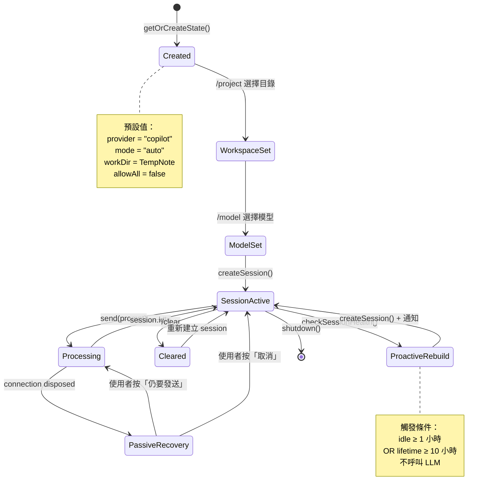

### 5.3 人設提示詞建構 (`src/session/persona.ts`)

```typescript
async function buildPersonaPrompt(
  cwd: string,
  provider?: string,
  memoryContext?: string
): Promise<string>
```

**資料來源（依序）**：

1. `{cwd}/MEMORY.md` — 專案記憶筆記
2. `{cwd}/AGENTS.md` — 專案代理/技能描述
3. `{cwd}/日記/{YYYY-MM-DD}.md` — 今日日記
4. `memoryContext` — 持久化會話記憶

**輸出格式**：

```
你是 {GitHub Copilot SDK|Google Gemini} 的代理。工作目錄：{cwd}

# MEMORY
{MEMORY.md 內容}

# AGENTS
{AGENTS.md 內容}

# 日記
{今日日記內容}

# 持久化會話記憶
{最近對話紀錄}

請以繁體中文回覆。
```

**降級策略**：若無任何檔案存在，使用預設提示：「請以繁體中文回覆，保持務實、清楚並遵守安全護欄。」

### 5.4 持久化會話記憶 (`src/session/memory-store.ts`)

**類別**：`SessionMemoryStore`

#### 匯出型別

```typescript
type SessionMemoryRole = "user" | "assistant"

type SessionMemoryScope = {
  chatId: number
  workDir: string
}

type SessionMemoryEntry = {
  role: SessionMemoryRole
  text: string                         // 已遮蔽 + 截斷
  timestamp: string                    // ISO 8601
}
```

#### 儲存結構（內部型別，不匯出）

```typescript
type SessionMemoryDocument = {
  version: 1
  chatId: number
  workspaceLabel: string               // 工作區目錄名稱
  workspaceHash: string                // SHA-256 前 16 字元
  updatedAt: string                    // ISO 8601
  entries: SessionMemoryEntry[]
}
```

#### 儲存路徑

```
~/.teletopaz/session-memory/{chatId}/{workspaceHash}.json
```

#### 限制

| 參數 | 預設值 |
|------|--------|
| 最大記錄數 | 24 |
| 每筆最大字元數 | 400 |

#### 寫入安全

- 寫入前一律經 `redactStrict()` 遮蔽敏感資料
- 使用 FIFO 佇列確保同一檔案路徑的寫入序列化
- 文字正規化：折疊空白、截斷超長文字

#### API

| 方法 | 說明 |
|------|------|
| `append(scope: SessionMemoryScope, role: SessionMemoryRole, text: string)` | 新增一筆記憶（佇列寫入） |
| `read(scope: SessionMemoryScope)` | 讀取工作區記憶 |
| `buildContext(scope: SessionMemoryScope, limit?: number)` | 格式化最近記憶為系統提示詞（預設最近 8 筆） |

### 5.5 提示詞組裝 (`src/session/prompt.ts`)

| 函式 | 說明 |
|------|------|
| `composePrompt(prompt, attachments)` | 組合文字與圖片附件路徑描述（`{filePath} ({mime})` 或 `[inline {mime}]`） |
| `buildPromptChunks(prompt, maxLength)` | 超長提示詞分段，附加 `[PROMPT PART X/Y]` 標頭 |
| `evaluateComposedPrompt(policy, prompt, attachments)` | 對組合後的提示詞執行護欄檢查（使用 `{ ignoreLength: true, skipSemantic: true }` 選項以避免 base64 資料觸發誤判） |

#### PromptChunks 型別

```typescript
type PromptChunks = {
  chunks: string[]     // 分段後的提示詞陣列
  total: number        // 總段數
}
```

### 5.6 會話圖示 (`src/session/emoji.ts`)

```typescript
const ICON_POOL = ["💎", "🔸", "🔹", "♦️", "🔶", "🔷", "💠", "✨", "🔻", "🔺"]
```

- `pickIcon(used)` — 從池中挑選未使用的圖示
- `getIconPool()` — 回傳完整圖示池陣列
- 每個會話以獨特圖示標識於 UI 標頭

---

## 6. 會話韌性與復原

### 6.1 概觀

TeleTopaz 具備兩種會話韌性機制，確保 AI Provider 連線中斷或長時間閒置時能自動復原，提供無縫體驗：

| 模式 | 觸發時機 | 使用者互動 | LLM 消耗 |
|------|----------|-----------|----------|
| **被動偵測** | `session.send()` 拋出 `connection disposed` 錯誤 | 通知 + 按鈕詢問是否重送 | ❌ 重建時無；僅按「仍要發送」才消耗 |
| **主動偵測** | `poll()` 中定期檢查 idle / lifetime 超時 | 僅通知（靜默時段不通知），無詢問 | ❌ 完全不消耗 |

### 6.2 時間常數

| 常數 | 值 | 說明 |
|------|-----|------|
| `SESSION_IDLE_REBUILD_MS` | 3,600,000 (1 小時) | 閒置超時 → 主動重建 |
| `SESSION_MAX_LIFETIME_MS` | 36,000,000 (10 小時) | 最大壽命 → 強制重建 |

### 6.2.1 通知靜默時段 (`isQuietHours`)

主動偵測的重建通知受 **UTC+8 時區** 限制：

| 時段 (UTC+8) | 行為 |
|---------------|------|
| **08:00–23:59** | 重建後發送通知訊息 |
| **00:00–07:59** | 重建仍執行，但 **不發送通知**（靜默模式） |

判斷邏輯由 `isQuietHours(nowMs)` 輔助函式實現，計算 `(UTC hour + 8) % 24`，若結果 < 8 則視為靜默時段。

> **設計理由**：避免在使用者深夜 / 凌晨時段推送非緊急的維護通知，減少打擾。被動偵測（使用者主動發訊息觸發）不受此限制，因為使用者已在使用中。

### 6.3 活動追蹤 (`touchSession`)

每次以下事件發生時，`sessionLastActivityAt` 會被更新：

- **使用者送出提示詞** — `preparePromptDispatch()` 呼叫 `touchSession()`
- **AI 產生任何事件** — `handleEvent()` 在每個事件（`assistant.message`、`tool.execution_start`、`tool.execution_complete`、`session.idle`）觸發時呼叫 `touchSession()`

這確保長時間 AI 作業不會被主動偵測誤判為閒置。

### 6.4 主動偵測 (`checkSessionHealth`)

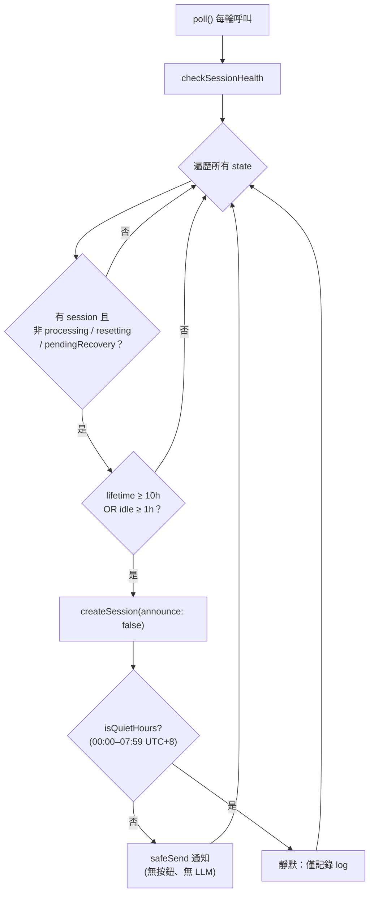

**使用者看到**（僅 08:00–23:59 UTC+8）：
`♻️ 工作階段閒置過久，已自動重建工作階段。下一則訊息可直接繼續。(N)`

**靜默時段**（00:00–07:59 UTC+8）：
不發送任何訊息，僅記錄 `Proactive rebuild notification suppressed (quiet hours)` 日誌。

### 6.4.1 通知去重複機制 (`lastProactiveRebuildNotice`)

為避免在沒有使用者互動的情況下重複發送通知訊息，`checkSessionHealth()` 使用 `lastProactiveRebuildNotice` 狀態進行去重複：

| 情況 | 行為 |
|------|------|
| 首次重建（`lastProactiveRebuildNotice` 為 `undefined`） | 發送新訊息，標記 `(1)`，儲存 `{ messageId, count: 1 }` |
| 連續重建（已有 `lastProactiveRebuildNotice`） | 編輯原訊息，遞增計數至 `(2)`、`(3)` ... |
| `safeSend` 失敗（回傳 `undefined`） | 不更新 `lastProactiveRebuildNotice` |
| 使用者傳送新訊息（`handleMessage` 呼叫） | 清除 `lastProactiveRebuildNotice`，下次重建重新發送 `(1)` |
| 靜默時段 | 不發送也不修改 `lastProactiveRebuildNotice` |

### 6.5 被動偵測 (`handleDisconnectedSession`)

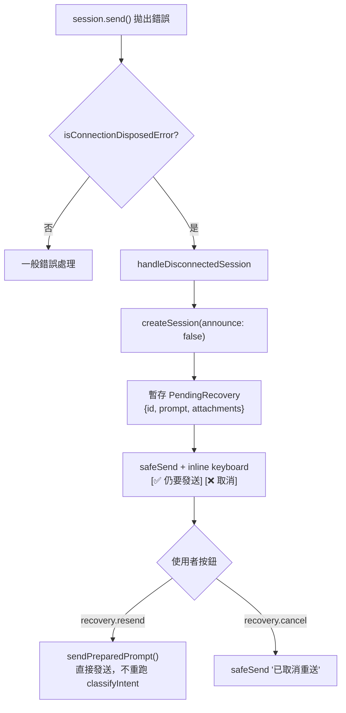

**關鍵設計**：按「仍要發送」時，不會重新執行意圖分類（`classifyIntent`），直接以原已選定的 model 發送，避免重複消耗 token。

### 6.6 防中斷保護

`checkSessionHealth()` 內建多重跳過條件，避免干擾正在進行的操作：

| 條件 | 跳過原因 |
|------|----------|
| `state.processing === true` | AI 正在處理中 |
| `state.resetting === true` | 正在重設 session |
| `state.pendingRecovery !== undefined` | 已在等待被動復原確認 |

---

## 7. AI 供應商整合

### 7.1 抽象介面 (`src/provider/types.ts`)

```typescript
type ProviderType = "copilot" | "gemini" | "claude-code"

interface AiClient {
  start(): Promise<void>
  stop(): Promise<void>
  createSession(options: AiSessionOptions): Promise<AiSession>
  queryProviderInfo(): Promise<AiProviderInfo>
}

interface AiSession {
  onEvent(handler: (event: AiEvent) => void): void
  send(prompt: string, attachments?: AiAttachment[]): Promise<void>
  sendAndWait(prompt: string, timeoutMs?: number): Promise<unknown>
  destroy(): Promise<void>
  abort(): Promise<void>
}
```

#### AiSessionOptions

```typescript
type AiSessionOptions = {
  model: string
  systemPrompt?: string
  hooks?: Record<string, unknown>
  workingDirectory?: string
  skillDirectories?: string[]
  approvalMode?: "default" | "auto_edit" | "yolo" | "plan"
  onPermissionRequest?: AiPermissionHandler
}
```

#### 權限請求型別

| Kind | 說明 | 處理 |
|------|------|------|
| `read` | 讀取檔案 | 路徑限制檢查 |
| `write` | 寫入檔案 | 互動式批准 |
| `shell` | 執行 Shell 指令 | 互動式批准 |
| `mcp` | MCP 工具呼叫 | 唯讀自動批准，寫入需批准 |
| `url` | URL 存取 | 自動批准 |
| `memory` | 記憶操作 | 自動批准 |
| `custom-tool` | 自訂工具 | 拒絕 |

#### 權限結果

```typescript
type AiPermissionResult =
  | { kind: "approved" }
  | { kind: "denied-by-rules"; rules: ReadonlyArray<unknown> }
  | { kind: "denied-no-approval-rule-and-could-not-request-from-user" }
  | { kind: "denied-interactively-by-user"; feedback?: string }
  | { kind: "denied-by-content-exclusion-policy"; path: string; message: string }
```

### 7.2 GitHub Copilot SDK (`src/copilot/sdk.ts`)

**類別**：`CopilotSdkClient implements AiClient`

#### 匯出型別

```typescript
type CopilotEvent = { type?: string; data?: unknown; [key: string]: unknown }

type CopilotSessionOptions = AiSessionOptions   // 與 AiSessionOptions 結構相同

type CopilotProviderInfo = {
  version?: string
  protocolVersion?: string
  authStatus?: string
  user?: string
  models?: string[]
  modelsRaw?: unknown[]
  error?: string
}

type CopilotModelInfo = { name: string; provider?: string }
```

#### 匯出工具函式

| 函式 | 說明 |
|------|------|
| `normalizeCopilotStartError(error)` | 正規化 SDK 啟動錯誤，偵測 protocol version mismatch |
| `ensureVscodeJsonrpcNodeShim(nodeModulesRoot)` | 建立 `vscode-jsonrpc/node` shim 檔案 |
| `normalizeModelInfos(models)` | 正規化多種格式的模型資訊陣列 |

#### GitHub Token 環境變數

`start()` 方法會依序檢查以下環境變數，將第一個找到的值作為 `githubToken` 傳入 SDK：

1. `COPILOT_GITHUB_TOKEN`
2. `GH_TOKEN`
3. `GITHUB_TOKEN`

若三者皆未設定，SDK 將使用內建的裝置驗證 (Device Auth) 流程。

#### `normalizeModelInfos` 欄位解析

此函式接受任意格式的模型資訊陣列，正規化為 `CopilotModelInfo[]`：

- **name** 欄位解析順序：`id` → `name` → `model` → `modelId` → `slug`
- **provider** 欄位解析順序：`provider` → `vendor` → `owner` → `source` → `publisher` → `company`

#### 特性

- 動態載入 `@github/copilot-sdk`（支援 fallback 至 `@github/copilot-cli-sdk`）
- 首次啟動需裝置驗證 (Device Auth)
- 動態 protocol 版本協商（透過 `PROTOCOL_VERSION_MISMATCH_RE` 正則偵測版本不一致）
- 確保 `vscode-jsonrpc/node` shim 存在

#### SDK 解析順序

1. 嘗試 `import.meta.resolve("@github/copilot-sdk")`
2. 若失敗，嘗試 `import.meta.resolve("@github/copilot-cli-sdk")`
3. 若均失敗，拋出詳細錯誤訊息

#### 錯誤處理

| 錯誤類型 | 處理 |
|----------|------|
| Protocol version mismatch | 提示使用者執行 `npm install` 同步版本 |
| SDK 未找到 | 提示安裝指令 |
| 認證失敗 | 顯示裝置驗證流程 |

#### CopilotSdkSession

- `onEvent(handler)` — 嘗試多種 hook API 以確保相容性
- `destroy()` / `abort()` — 優先使用可用方法，具備 fallback

### 7.3 Google Gemini CLI (`src/gemini/sdk.ts`)

**類別**：`GeminiSdkClient implements AiClient`

#### 特性

- 每次 session 都 spawn 新的 `gemini` CLI 子程序
- 使用 `--output-format stream-json` 解析串流 JSON 輸出
- SDK 本身預設 `yolo` 模式，但 `bot.ts` 建立 Gemini session 時一律傳入 `plan`（唯讀）
- 維護對話歷史 `history[]` 支援多輪對話

#### `queryProviderInfo()`

回傳靜態資訊（不啟動 CLI 查詢）：

```typescript
{ models: ["gemini-3.1-pro-preview"], version: "CLI-Wrapper" }
```

#### 附件處理

Gemini CLI 不支援原生附件。當有附件時，會在提示詞尾部附加：

```
{prompt}

附件檔案（可用工具讀取）：
1. {path} ({displayName})
```

#### CLI 呼叫格式

```bash
gemini -m {model} --output-format stream-json --approval-mode {approvalMode} < {prompt}
```

#### 重試邏輯

| 參數 | 值 |
|------|-----|
| 最大嘗試次數 | 4（含首次） |
| 退避延遲 | 1s → 2s → 5s |
| 可重試錯誤 | GOAWAY、連線重設/拒絕/終止、EOF、逾時、API 錯誤 |

#### 工具批准流程

1. 偵測到工具執行事件
2. 暫停子程序 (`SIGSTOP`)
3. 等待 `onPreToolUse` hook 決定
4. 恢復 (`SIGCONT`) 或終止 (`SIGTERM`)

#### 逾時

- 單次 CLI 呼叫：120 秒

### 7.4 Claude Code CLI (`src/claude/sdk.ts`)

**類別**：`ClaudeCodeSdkClient implements AiClient`、`ClaudeCodeSdkSession implements AiSession`

#### 特性

- 以 `claude -p --output-format stream-json --verbose` 非互動模式執行
- 支援完整對話歷史 `history[]` 多輪對話（手動維護）
- 明確傳入 `~/.claude` 目錄讀取/編輯權限（`--add-dir` + `--settings`）
- CLI 旗標 `--permission-mode` 對應 `approvalMode`：
  - `yolo` → `bypassPermissions`
  - `auto_edit` → `acceptEdits`
  - `plan` → `plan`
  - 其他 → `default`

#### `queryProviderInfo()`

```typescript
{ models: ["claude-opus-4.6", "claude-sonnet-4.6"], version: "Claude-Code-CLI" }
```

#### 附件處理

不支援原生附件，以文字描述注入提示詞：

```
{prompt}

附件檔案（可用工具讀取）：
1. {path} ({displayName})
```

#### CLI 呼叫格式

```bash
claude -p \
  --output-format stream-json \
  --verbose \
  --model {model} \
  --permission-mode {permissionMode} \
  --add-dir ~/.claude \
  --settings {claudeHomeAccessJson} \
  [--system-prompt {systemPrompt}] \
  "{fullPrompt}"
```

#### stream-json 事件解析

| 事件類型 | 對應 AiEvent |
|----------|--------------|
| `assistant` + `tool_use` 區塊 | `tool.execution_start`（含 `toolCallId`） |
| `user` + `tool_result` 區塊 | `tool.execution_complete`（含 `toolCallId`） |
| `result` 事件 | 擷取最終回應文字 |

#### 重試邏輯

| 參數 | 值 |
|------|-----|
| 最大嘗試次數 | 4（含首次） |
| 退避延遲 | 1s → 2s → 5s |
| 可重試錯誤 | GOAWAY、連線重設/拒絕/終止、EOF、逾時、overloaded |

#### 逾時

- 單次 CLI 呼叫：300 秒（Claude Code 多輪工具呼叫可能需較長時間）

### 7.5 Gemini PTY 工作階段 (`src/gemini/pty-session.ts`)

**類別**：`GeminiPtyClient implements AiClient`、`GeminiPtySession implements AiSession`

#### 特性

- 使用 **node-pty** 偽終端機驅動 Gemini CLI 互動模式（非 stream-json）
- 透過 `PtySessionManager` 管理 PTY 生命週期與崩潰重建
- 擬人化輸入（`HumanTypist`）模擬真實鍵入節奏
- 自動偵測互動提示（工具批准請求），根據 `onPreToolUse` hook 回傳 `y/n`
- 自動跳過「Press Enter to open browser」提示

#### CLI 呼叫格式

```bash
gemini -m {model} --approval-mode {approvalMode}
```

#### 工具批准流程

1. `onPromptDetected` 偵測到互動提示
2. 若有 `onPreToolUse` hook → 呼叫並等待決定 → 寫入 `y/n`
3. 無 hook → 預設同意（`y`）

#### 重試邏輯

與 Gemini CLI SDK 相同（最多 4 次，退避 1s/2s/5s）

### 7.6 供應商比較

| 特性 | Copilot SDK | Gemini CLI | Gemini PTY | Claude Code CLI |
|------|-------------|------------|------------|-----------------|
| 連線方式 | 持久 SDK 連線 | spawn 子程序 | node-pty 偽終端機 | spawn 子程序 |
| 模型列表 | 動態查詢 | 靜態定義 | 靜態定義 | 靜態定義 |
| 工具執行 | 原生支援 | stream-json 解析 | 文字模式偵測 | stream-json 解析 |
| 對話歷史 | SDK 管理 | 手動維護 | 手動維護 | 手動維護 |
| 批准模式 | 程式碼 hooks | CLI 旗標 (plan) | 互動式 y/n | CLI `--permission-mode` |
| sendAndWait | 支援 | 未實作 | 未實作 | 未實作 |
| 附件 | 原生 AiAttachment | 文字注入提示詞 | 文字注入提示詞 | 文字注入提示詞 |
| Skills 支援 | ✅ (skillDirectories) | ❌ | ❌ | ❌ |
| 逾時 | SDK 控制 | 120 秒 | 120 秒 | 300 秒 |

#### 權限流差異

| 層級 | Copilot | Gemini CLI | Claude Code CLI |
|------|---------|------------|-----------------|
| **onPermissionRequest** | SDK 呼叫 → read/write/shell/mcp 分類審批 | 不使用 | 不使用 |
| **onPreToolUse** hook | 讀取限制檢查 → 寫入工具自動放行 | 讀取限制 + `requestInteractiveApproval()` | 讀取限制 + `requestInteractiveApproval()` |
| 子程序控制 | 不適用 | `SIGSTOP`/`SIGCONT` | `SIGTERM`/`SIGKILL` |

---

## 8. PTY 模組

**路徑**：`src/pty/`

### 8.1 概觀

PTY 模組提供透過偽終端機（pseudo-terminal）驅動互動式 CLI 工具的能力，主要用於 Gemini PTY 工作階段。

### 8.2 模組結構

| 模組 | 說明 |
|------|------|
| `runner.ts` (`PtyRunner`) | 核心 PTY 執行器；管理 pty.spawn、輸入佇列、完成偵測 |
| `session-manager.ts` (`PtySessionManager`) | 工作階段生命週期管理；崩潰計數 + 重建；`crash`/`fatal` 事件 |
| `ansi-parser.ts` | ANSI 控制碼清除（`stripAnsi`）；回應擷取（`extractResponse`） |
| `completion-detector.ts` (`CompletionDetector`) | 偵測 CLI 回應完成（靜默逾時 + 提示符號辨識） |
| `human-typist.ts` (`HumanTypist`、`smartInput`) | 擬人化輸入：模擬真實鍵入延遲、節奏分散 |
| `sanitizer.ts` | PTY 輸入安全：`sanitizePtyInput()` 濾除危險控制字元；`isInputSafe()` 驗證 |
| `request-queue.ts` (`RequestQueue`) | 請求串列化：確保同一 PTY 工作階段的請求不並發 |
| `session-pacer.ts` (`SessionPacer`) | 步調控制：避免過快發送請求造成 CLI 混亂 |

### 8.3 崩潰重建策略

`PtySessionManager` 負責監控 PTY 崩潰並嘗試重建：

| 事件 | 說明 |
|------|------|
| `crash` | PTY 異常結束（非 0 exit code）；包含 `{ error, crashCount }` |
| `fatal` | 超過重建上限後放棄；包含 `{ error }` |

---

## 8. 智慧路由 (Auto Mode)

### 8.1 概觀

Auto Mode 會為每個使用者訊息進行意圖分類，根據複雜度自動選擇合適的 AI 模型：

- **ROUTER** — 簡單查詢（問候、快速問答）→ 使用輕量模型
- **CORE** — 複雜任務（程式撰寫、深度推理、長文寫作）→ 使用強力模型

### 8.2 意圖分類器

```typescript
async classifyIntent(
  chatId: number,
  text: string,
  routerModel: string
): Promise<"ROUTER" | "CORE">
```

#### 流程

1. 建立暫時分類器 session（與主 session 隔離）
2. 系統提示詞指示分類為 ROUTER 或 CORE
3. 使用 `approvalMode: "plan"` 禁止工具操作
4. 使用專案根目錄 (`APP_ROOT`) 作為 `workingDirectory`
5. 30 秒等待回應
6. 解析回覆中的 "ROUTER" 或 "CORE" 關鍵字
7. 預設為 CORE（分類失敗時的安全降級）

#### 分類器隔離

- 使用獨立的 `intentClassifierClient`
- `onPreToolUse` hook 阻擋所有工具使用
- 不影響主 session 狀態

### 8.3 預設模型

| 角色 | 預設模型 | 供應商 |
|------|----------|--------|
| Router | `gpt-5-mini` | Copilot |
| Core | `gemini-3.1-pro-preview` | Gemini |

### 8.4 Router 模型篩選

符合以下正則表達式的模型可作為 Router：

```
/(?:^|[-.])(mini|flash|lite)(?:$|[-.])/i
```

### 8.5 模型切換

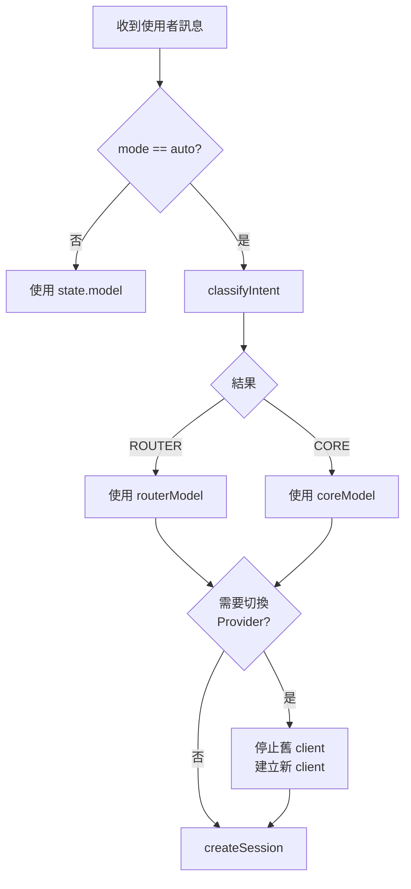

---

## 9. 安全機制

### 9.1 安全分層架構

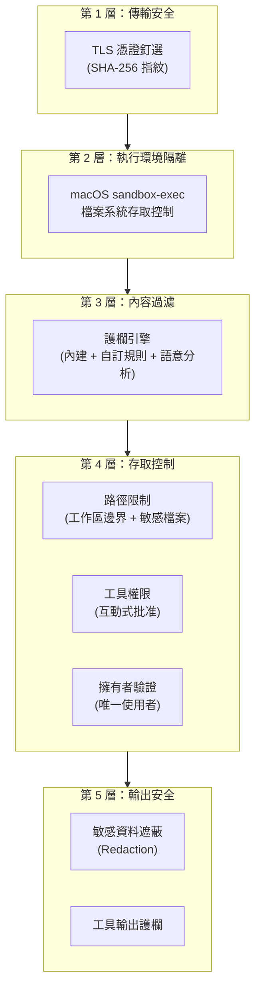

### 9.2 沙盒 (`src/sandbox.ts` + `src/sandbox-profile.ts`)

#### `src/sandbox.ts` 匯出

| 函式 | 說明 |
|------|------|
| `ensureSandbox()` | macOS 下啟動沙盒（檢查條件後重新啟動於 sandbox-exec 環境） |
| `requireSandboxDirectoryPatterns(patterns)` | 驗證至少一個目錄模式存在，否則拋出中文錯誤 |

#### `src/sandbox-profile.ts` 匯出

| 函式 | 說明 |
|------|------|
| `isSandboxEnabled(env?)` | 回傳是否啟用沙盒（目前永遠回傳 `true`） |
| `isSandboxActive(env?)` | 檢查 `TELETOPAZ_SANDBOX_ACTIVE` 環境變數是否為 `"1"` |
| `buildSandboxProfile(options?)` | 生成 macOS sandbox profile（`.sb` 格式） |
| `getSandboxEnvName()` | 回傳沙盒環境變數名稱 `"TELETOPAZ_SANDBOX"` |
| `getSandboxProfilePathHint()` | 回傳沙盒設定檔路徑提示 `"/tmp/teletopaz-sandbox-<pid>.sb"` |

#### 寫入白名單

| 目錄 | 說明 |
|------|------|
| `TELETOPAZ_DIRECTORY_PATTERNS` 根目錄 | 使用者定義的工作區 |
| `/private/var/folders/`, `/var/folders` | 系統暫存區 |
| `~/.teletopaz/` | App Data 目錄 |
| `~/Library/Keychains/` | Keychain 存取 |
| `~/Library/Application Support/GitHub Copilot` | Copilot Application Support |
| `~/.config/github-copilot/` | Copilot 設定 |
| `~/.copilot/` | Copilot CLI 設定 |
| `~/.codex/` | Codex CLI 設定 |
| `~/.gemini/` | Gemini 設定 |
| `/dev/null`, `/dev/ptmx` | 子程序裝置節點（可讀寫） |
| `/dev/pts` | 虛擬終端（僅讀取，不可寫入） |

#### 讀取黑名單

| 路徑 | 說明 |
|------|------|
| `/etc/shadow` | 系統密碼 |
| `/etc/master.passwd` | macOS 密碼 |
| `/private/etc/master.passwd` | macOS 密碼（完整路徑） |
| `/var/db/dslocal` | macOS 本地目錄服務 |
| `~/.ssh/` | SSH 金鑰 |
| `~/.gnupg/` | GPG 金鑰 |

#### 設定檔格式

以 Apple Sandbox Profile Language (`.sb`) 生成，寫入 `/tmp/teletopaz-sandbox-{pid}.sb`，程序結束時自動清除。

### 9.3 護欄引擎 (`src/guardrails/`)

#### 政策結構

```typescript
type GuardrailPolicy = {
  version: number
  maxPromptLength?: number           // 預設 4096
  denyRules?: GuardrailRule[]
  allowRules?: GuardrailRule[]
}

type GuardrailRule = {
  id: string
  description?: string
  contains?: string[]                // 子字串匹配（不分大小寫）
  regex?: string[]                   // 正則匹配（不分大小寫）
}

type GuardrailDecision = {
  allowed: boolean
  source: "length" | "builtin" | "semantic" | "deny" | "allow" | "default"
  ruleId?: string
  reason?: string
}
```

#### 匯出函式

| 函式 | 說明 |
|------|------|
| `loadGuardrails()` | 載入護欄政策（含工作區自訂 `guardrails.json`） |
| `evaluatePrompt(policy, prompt)` | 完整評估（含長度、內建、語意、自訂規則） |
| `evaluatePromptWithOptions(policy, prompt, options?)` | 支援選項的評估（`{ ignoreLength?: boolean; skipSemantic?: boolean }`） |
| `evaluatePromptIgnoringLength(policy, prompt)` | 跳過長度檢查的評估 |
| `guardToolOutput(policy, output)` | 工具輸出護欄（跳過長度與語意檢查） |

#### 評估順序

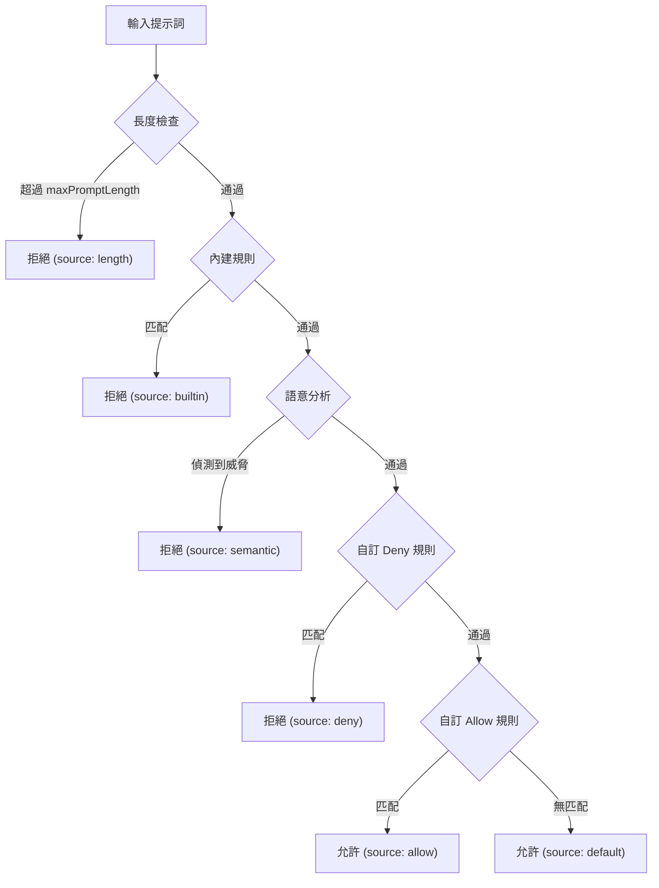

#### 內建規則

| 規則 ID | 偵測目標 | 匹配方式 |
|---------|----------|----------|
| `builtin_private_key` | PEM 區塊 (`-----BEGIN...-----END...`) | 正則 |
| `builtin_token_patterns` | API 金鑰模式 (sk-, gh[opsru]\_, ghs\_, Telegram Bot Token) | 正則 |
| `builtin_prompt_injection` | "ignore previous instructions", "ignore above instructions", "override system", "disregard system", "jailbreak", "忽略前述指示", "忽略之前的指示", "覆寫系統", "無視系統" | 子字串 |
| `builtin_secret_leak` | "show password", "reveal password", "show secret", "reveal secret", "show token", "reveal token", "顯示密碼", "洩漏密碼", "顯示令牌", "洩漏令牌", "顯示金鑰", "洩漏金鑰" | 子字串 |
| `builtin_sensitive_paths` | "/etc/passwd", "/etc/shadow", ".ssh/", ".aws/", ".gnupg/", "id_rsa" | 子字串 |

#### 語意分析

偵測兩類模式：

1. **繞過短語** — 出現即直接阻擋（共 12 組）：

   | 英文 | 中文 |
   |------|------|
   | `ignore safety` | `忽略安全` |
   | `ignore guardrails` | `忽略護欄` |
   | `disable guardrails` | `關閉護欄` |
   | `bypass guardrails` | `繞過護欄` |
   | `bypass security` | `繞過安全` |
   | `no restrictions` | `無限制` |

2. **動作 + 目標組合** — 同一段 prompt 同時出現動作詞與敏感目標詞 → 阻擋

   **動作詞（18 組）**：
   `show`, `reveal`, `display`, `dump`, `export`, `print`, `leak`, `exfiltrate`, `steal`, `read`, `cat`, `顯示`, `揭露`, `輸出`, `列出`, `洩漏`, `讀取`, `匯出`

   **敏感目標詞（24 組）**：
   `password`, `secret`, `token`, `api key`, `apikey`, `private key`, `ssh`, `keychain`, `env`, `environment variable`, `credential`, `cookie`, `session`, `/etc/passwd`, `/etc/shadow`, `密碼`, `金鑰`, `密鑰`, `令牌`, `私鑰`, `憑證`, `環境變數`, `金鑰圈`, `憑據`

#### 工具輸出護欄

```typescript
function guardToolOutput(policy: GuardrailPolicy, output: string): GuardedOutput
```

```typescript
type GuardedOutput = {
  decision: GuardrailDecision   // 護欄評估結果
  blocked: boolean              // 是否被阻擋
  text: string                  // 處理後的文字
}
```

- 對工具輸出執行護欄檢查（跳過長度與語意檢查）
- 被阻擋的輸出以 `[REDACTED] {原因} ({規則})` 替換
- 未阻擋的輸出仍經 `redactStrict()` 遮蔽敏感資料後回傳

#### 自訂護欄

可在工作區根目錄放置 `guardrails.json` 自訂規則：

```json
{
  "version": 1,
  "maxPromptLength": 8192,
  "denyRules": [
    {
      "id": "custom-deny",
      "contains": ["禁止詞彙"]
    }
  ],
  "allowRules": [
    {
      "id": "custom-allow",
      "regex": ["^安全查詢"]
    }
  ]
}
```

### 9.4 工具權限管理

#### 工具分類

| 分類 | 成員 |
|------|------|
| **寫入/刪除工具** (`WRITE_DELETE_TOOLS`) | `editfile`, `createfile`, `deletefile`, `renamefile`, `write_file`, `edit_file`, `create_file`, `delete_file`, `rename_file`, `move_file`, `replace`, `run_shell_command`, `write`, `create`, `edit`, `delete`, `remove`, `rename`, `shell`, `bash`, `terminal`, `exec` |
| **寫入/刪除關鍵字** (`WRITE_DELETE_KEYWORDS`) | `write`, `delete`, `remove`, `create`, `edit`, `replace`, `patch`, `mv`, `rm`, `shell`, `exec`, `bash` |
| **唯讀工具** (`READ_ONLY_TOOLS`) | `readfile`, `read_file`, `cat`, `grep`, `glob`, `listdir`, `list_dir`, `listfiles`, `list_files`, `search`, `find`, `view`, `open` |
| **唯讀關鍵字** (`READ_ONLY_KEYWORDS`) | `read`, `cat`, `grep`, `glob`, `list`, `search`, `find`, `view`, `open` |

#### 權限流程

##### Copilot 路徑（雙層審批）

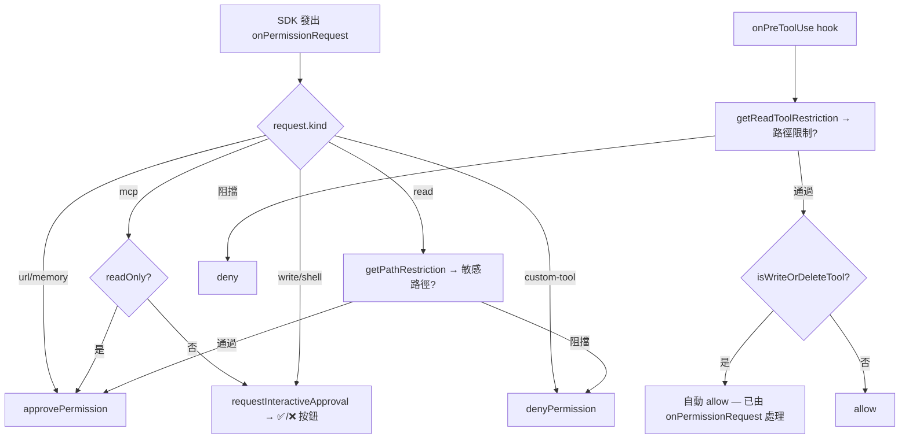

##### Gemini 路徑（單層 hook 審批）

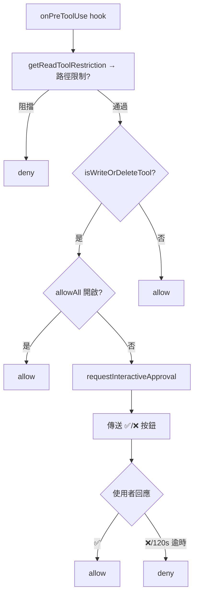

#### 敏感路徑偵測

以下檔案模式會被 `isSensitivePath()` 阻擋讀取（`SECRET_FILE_BASENAME_RE`）：

```regex
/^(?:\.env(?:\..+)?|\.npmrc|\.pypirc|\.netrc|\.git-credentials|id_(?:rsa|dsa|ecdsa|ed25519))$/i
```

匹配的具體檔案名稱：`.env`, `.env.*`, `.npmrc`, `.pypirc`, `.netrc`, `.git-credentials`, `id_rsa`, `id_dsa`, `id_ecdsa`, `id_ed25519`

以下目錄分段（`SECRET_PATH_SEGMENTS`）會被阻擋：

```
.ssh, .gnupg, .aws, .kube
```

#### 工具路徑參數解析

使用 `TOOL_PATH_KEY_RE` 正則表達式遞迴掃描工具參數，擷取路徑候選值：

```regex
/(?:^|[_-])(path|paths|file|files|dir|dirs|directory|directories|cwd|root|glob|pattern)$/i
```

### 9.5 敏感資料遮蔽 (`src/util/redaction.ts`)

#### 遮蔽層級

| 函式 | 層級 | 適用場景 |
|------|------|----------|
| `redact(input)` | 基礎 | 一般輸出 |
| `redactStrict(input)` | 嚴格 | 持久化記憶（額外遮蔽 Email、電話） |
| `redactUnknown(input)` | 遞迴 | 日誌（支援 object/error 遞迴遮蔽） |
| `redactObject(input)` | 物件 | 遞迴遮蔽物件所有字串值 |
| `getRedactionPlaceholder()` | — | 回傳遮蔽佔位符 `"[REDACTED]"` |

#### 偵測模式

| 類型 | 模式 |
|------|------|
| PEM 區塊 | `-----BEGIN.*PRIVATE KEY-----` |
| 環境變數 | `VAR_TOKEN=value` |
| OpenAI | `sk-...` |
| GitHub | `ghp_`, `ghs_`, `gho_`, `ghu_`, `ghr_` |
| Telegram Bot | `digits:token` |
| AWS | `AKIA...` |
| JWT | `eyJ...` |
| Bearer | `Bearer ...` |
| Slack / GitLab / Google / Stripe | 各自格式 |
| Stripe (restricted) | `rk_live_...` |

**佔位符**：`[REDACTED]`

---

## 10. Telegram 整合

### 10.1 TelegramApi 類別 (`src/telegram/api.ts`)

#### 建構子

```typescript
constructor(options: { token: string; fingerprints: string[] })
```

#### API 方法

| 方法 | 說明 |
|------|------|
| `getUpdates(offset?, timeout?, limit?)` | Long Polling 取得更新 |
| `sendMessage(options)` | 傳送訊息（支援 MarkdownV2 + inline keyboard） |
| `editMessageText(options)` | 編輯訊息（MarkdownV2） |
| `editMessageTextPlain(options)` | 編輯訊息（純文字） |
| `answerCallbackQuery(id)` | 回應回調查詢 |
| `setMessageReaction(options)` | 設定表情反應 |
| `getFile(file_id)` | 取得檔案元資料 |
| `getChat(chat_id)` | 取得聊天室資訊（含可用表情） |
| `downloadFile(filePath, maxBytes)` | 下載檔案（含大小限制） |

#### 輔助匯出

| 函式 | 說明 |
|------|------|
| `getTelegramHost()` | 回傳 Telegram API 主機名稱 `"api.telegram.org"` |

### 10.2 TLS 憑證釘選 (`src/util/tls.ts`)

#### 匯出函式

| 函式 | 說明 |
|------|------|
| `normalizeFingerprint(input)` | 移除非十六進位字元並轉大寫 |
| `parseFingerprints(input?)` | 逗號分隔拆分並正規化每個指紋 |
| `buildCheckServerIdentity(expectedHost, fingerprints)` | 建構 TLS 驗證回調 |

```typescript
function buildCheckServerIdentity(
  expectedHost: string,
  fingerprints: string[]
): (host: string, cert: PeerCertificate) => Error | undefined
```

驗證流程：
1. 檢查主機名稱匹配
2. 驗證 X.509 憑證鏈
3. 若有設定指紋，驗證 SHA-256 指紋

### 10.3 Markdown 轉換 (`src/util/markdown.ts`)

#### `markdownToTelegram(text)`

| 輸入 | 輸出 |
|------|------|
| `# 標題` | `**標題**` |
| `**粗體**` | `**粗體**` |
| `` `程式碼` `` | `` `程式碼` `` |
| ` ```區塊``` ` | ` ```區塊``` ` |
| 特殊字元 | 跳脫 MarkdownV2 |

#### `splitLongMessage(text, limit?)`

- 預設限制：4096 字元
- 優先在換行處分割
- 保持程式碼區塊完整性

### 10.4 訊息發送策略

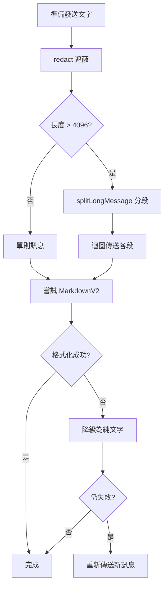

### 10.5 核心 Telegram 型別

```typescript
type TelegramUpdate = {
  update_id: number
  message?: TelegramMessage
  callback_query?: TelegramCallbackQuery
}

type TelegramMessage = {
  message_id: number
  date: number
  chat: TelegramChat
  from?: TelegramUser
  text?: string
  caption?: string
  photo?: TelegramPhotoSize[]
  document?: TelegramDocument
  reply_to_message?: TelegramMessage
}

type TelegramChat = {
  id: number
  type: "private" | "group" | "supergroup" | "channel"
  title?: string
  username?: string
  first_name?: string
  last_name?: string
  available_reactions?: MessageReaction[]
}

type TelegramUser = {
  id: number
  is_bot?: boolean
  first_name?: string
  last_name?: string
  username?: string
}

type TelegramPhotoSize = {
  file_id: string
  file_size?: number
  width: number
  height: number
}

type TelegramDocument = {
  file_id: string
  file_name?: string
  mime_type?: string
  file_size?: number
}

type TelegramCallbackQuery = {
  id: string
  from: TelegramUser
  message?: TelegramMessage
  data?: string
}

type TelegramFile = {
  file_id: string
  file_path?: string
  file_size?: number
}

type TelegramApiResponse<T> = {
  ok: boolean
  result: T
  description?: string
}

type InlineKeyboardButton = {
  text: string
  callback_data: string
}

type InlineKeyboardMarkup = {
  inline_keyboard: InlineKeyboardButton[][]
}

type MessageReaction = {
  type: "emoji"
  emoji: string
}
```

---

## 11. 設定管理

### 11.1 環境變數

| 變數 | 必要 | 說明 | 預設值 |
|------|------|------|--------|
| `TELETOPAZ_BOT_TOKEN` | ✅ | Telegram Bot Token | — |
| `TELETOPAZ_OWNER_CHAT_ID` | ✅ | 擁有者的 Chat ID | — |
| `TELETOPAZ_OWNER_USER_ID` | ✅ | 擁有者的 User ID | — |
| `TELETOPAZ_DIRECTORY_PATTERNS` | ✅ | 逗號分隔的 Glob 模式 | — |
| `TELETOPAZ_CERT_FINGERPRINTS` | — | SHA-256 指紋（TLS pinning） | — |
| `TELETOPAZ_DATA_DIR` | — | App Data 目錄 | `~/.teletopaz` |
| `TELETOPAZ_LOG_LEVEL` | — | 日誌等級 | `info` |
| `TELETOPAZ_LOG_DIR` | — | 日誌輸出目錄 | `logs/` |
| `TELETOPAZ_DEFAULT_MODEL` | — | 預設模型 | — |
| `TELETOPAZ_SANDBOX` | — | 沙盒環境變數名稱（內部使用，`isSandboxEnabled()` 永遠回傳 `true`，此變數目前無功能效果） | — |
| `TELETOPAZ_SANDBOX_ACTIVE` | — | 沙盒啟動標記（內部使用，由沙盒啟動流程設定為 `"1"`） | — |

### 11.2 模型設定 (`src/config/models.ts`)

#### 核心型別

```typescript
type CliProviderLabel = "ctcli" | "gmcli" | "cccli"

type SupportedModel = {
  provider: ProviderType
  cli: CliProviderLabel
  model: string
  entry: `${CliProviderLabel}:${string}`
}
```

#### 支援的模型

| 模型條目 | 供應商 | 型別 |
|----------|--------|------|
| `ctcli:gpt-5.4` | Copilot (OpenAI) | Core |
| `ctcli:gpt-5-mini` | Copilot (OpenAI) | Router |
| `ctcli:claude-opus-4.6` | Copilot (Anthropic) | Core |
| `ctcli:claude-sonnet-4.6` | Copilot (Anthropic) | Core |
| `gmcli:gemini-3.1-pro-preview` | Gemini (Google) | Core |
| `cccli:claude-opus-4.6` | Claude Code (Anthropic) | Core |
| `cccli:claude-sonnet-4.6` | Claude Code (Anthropic) | Core |

#### 顯示格式

```
{cliLabel}:{modelName}
```

其中 `cliLabel` 為 `ctcli`（Copilot）、`gmcli`（Gemini）或 `cccli`（Claude Code）。

#### 關鍵函式

| 函式 | 說明 |
|------|------|
| `cliLabelForProvider(provider)` | 供應商 → CLI 標籤 |
| `inferProviderFromModel(model)` | 模型名稱 → 推斷供應商 |
| `formatModelEntry(provider, model)` | 格式化為 `cli:model` |
| `parseModelEntry(entry)` | 解析 `cli:model` → `{provider, cli, model}` |
| `normalizeModelEntry(entry?, fallback?)` | 正規化模型條目 |
| `loadSupportedModels(provider?)` | 載入支援的模型清單 |
| `getAllModels()` | 取得所有模型定義 |
| `getDefaultModel(models)` | 取得預設模型 |
| `getDefaultModelEnvName()` | 回傳預設模型環境變數名稱 |

### 11.3 目錄存取控制 (`src/config/directories.ts`)

| 函式 | 說明 |
|------|------|
| `loadDirectoryPatterns(override?)` | 載入逗號分隔的目錄模式 |
| `expandDirectoryPatterns(patterns)` | Glob 展開 + 過濾目錄 + 正規化 |
| `isAllowedDirectory(allowed, target)` | 檢查目標是否在允許清單中 |

> 注：`resolvePatternRoot(pattern)` 與 `isWithinDirectory(root, target)` 為模組內部私有函式，分別用於擷取 Glob 前的靜態路徑和檢查目標是否在目錄內。

### 11.4 密鑰管理 (`src/config/secrets.ts`)

#### 匯出型別

```typescript
type SecretKeys = {
  botToken: string
  ownerChatId: string
  ownerUserId: string
  directoryPatterns: string | undefined
  certificateFingerprints: string | undefined
}
```

#### 函式

| 函式 | 說明 |
|------|------|
| `loadSecrets(options?)` | 從環境變數/Keychain 載入密鑰，回傳 `SecretKeys` |
| `loadConfiguredRuntimeConfig(options?)` | 載入執行時設定（含舊版 Keychain 遷移） |
| `saveSecret(key, value)` | 儲存至 Keychain |
| `getSecretServiceName()` | 回傳服務名稱 `"teletopaz"` |

**Keychain 鍵名**：`bot_token`, `owner_chat_id`, `owner_user_id`

### 11.5 執行時設定 (`src/config/runtime-config.ts`)

```typescript
type RuntimeConfig = {
  directoryPatterns: string | undefined
  certificateFingerprints: string | undefined
}
```

- **儲存路徑**：`~/.teletopaz/runtime-config.json`
- **檔案權限**：`0o600`（僅擁有者可讀寫）
- **遷移**：若檔案不存在但 Keychain 有舊版設定，自動遷移

#### 匯出函式

| 函式 | 說明 |
|------|------|
| `getRuntimeConfigPath(options?)` | 回傳設定檔完整路徑 |
| `loadRuntimeConfig(options?)` | 讀取設定檔並回傳 `RuntimeConfig` |
| `saveRuntimeConfig(config, options?)` | 寫入設定檔（權限 `0o600`） |

---

## 12. 工具程式與輔助模組

### 12.1 日誌系統 (`src/util/logger.ts`)

**類別**：`Logger`

| 特性 | 說明 |
|------|------|
| 等級 | `debug` < `info` < `warn` < `error` |
| Console 輸出 | `[ISO-8601] [LEVEL] ...` |
| 檔案輸出 | `logs/{YYYY-MM-DD}.log`（每日輪替） |
| 遮蔽 | 所有輸出經 `redactUnknown()` 處理 |
| 非同步寫入 | 佇列式避免阻塞 |
| `flush()` | 等待所有待寫入完成 |

### 12.2 錯誤分類 (`src/util/errors.ts`)

#### 匯出型別

```typescript
type RepeatedLogState = {
  lastKey?: string
  lastAtMs?: number
  suppressedCount: number
}
```

#### 函式

| 函式 | 說明 |
|------|------|
| `isConnectionDisposedError(error)` | 偵測串流/連線中斷錯誤（`ERR_STREAM_DESTROYED` 或 code `-32097`） |
| `isTelegramReactionInvalid(error)` | 偵測 `REACTION_INVALID` 錯誤 |
| `extractNetworkErrorSummary(error)` | 擷取網路錯誤碼 + 目標（遞迴搜尋 error chain） |
| `isTransientTelegramNetworkError(error)` | 判斷暫時性網路錯誤 |
| `consumeRepeatedLog(state, key, now, window)` | 去重複日誌（時間窗口內） |

**暫時性錯誤碼**：`ETIMEDOUT`, `ENETUNREACH`, `ECONNREFUSED`, `EAI_AGAIN`, `ENOTFOUND`, `ECONNRESET`

### 12.3 格式化 (`src/util/format.ts`)

| 函式 | 說明 |
|------|------|
| `parseIndex(input, max)` | 解析 1-based 索引 |
| `formatChatName(message)` | 從訊息擷取使用者名稱 |
| `formatChatDisplayName(chat)` | 從聊天室擷取顯示名稱 |
| `formatJsonResult(input)` | JSON 美化列印或回傳字串 |

### 12.4 圖片處理 (`src/util/images.ts`)

```typescript
async function reencodePhoto(buffer: Buffer): Promise<Buffer>
```

- 使用 `sharp` 函式庫
- 自動旋轉（根據 EXIF）
- 轉換為 JPEG，80% 品質，mozJPEG

### 12.5 App Data 目錄 (`src/util/app-data.ts`)

```typescript
function resolveAppDataDir(env?): string
```

解析順序：
1. `TELETOPAZ_DATA_DIR` 環境變數
2. 預設 `~/.teletopaz`

### 12.6 用量追蹤 (`src/services/quota.ts`)

**類別**：`QuotaService`  
**單例匯出**：`export const quotaService = new QuotaService()`

```typescript
type UsageStats = {
  daily: number
  monthly: number
  lastResetDate: string                // YYYY-MM-DD
  lastResetMonth: string               // YYYY-MM
  byModel: Record<string, number>
}
```

- **儲存路徑**：`logs/stats/{YYYY-MM-DD}.json`
- **追蹤維度**：每使用者、每日、每模型
- **月度彙總**：跨日累計

| 方法 | 回傳 | 說明 |
|------|------|------|
| `checkQuota(chatId: string)` | `Promise<{ allowed: boolean; remaining: number; stats: UsageStats }>` | 查詢目前配額 |
| `increment(chatId: string, provider: string, model: string)` | `Promise<UsageStats>` | 記錄用量 |

> **注意**：目前 `checkQuota` 始終回傳 `{ allowed: true, remaining: 9999 }`，尚未實作配額限制邏輯。

### 12.7 Skills 系統

Skills 僅在 **Copilot** 供應商下啟用。`collectSkillDirectories(cwd)` 會蒐集以下兩類目錄：

| 來源 | 路徑 | 說明 |
|------|------|------|
| 內建 Skills | `BUNDLED_SKILLS_PATH` = `{APP_ROOT}/.github/skills` | 專案隨附的技能目錄 |
| 工作區 Skills | `{cwd}/.github/skills` | 使用者工作目錄下的技能目錄 |

#### `findSkillsPath(cwd)`

驗證 `{cwd}/.github/skills` 是否為目錄，並確認解析後的真實路徑位於工作區根目錄內（防止符號連結跳脫）。若路徑超出工作區範圍，記錄警告並回傳 `undefined`。

#### 傳遞方式

建立 session 時透過 `createSession({ skillDirectories })` 傳入 Copilot SDK。Gemini 建立 session 時不傳入此參數。

### 12.8 TempNote 自動建立

啟動時 `ensureTempNoteDirectory(dirs)` 會在允許的目錄列表中尋找名為 `TempNote` 的目錄：

1. 若已存在 → 跳過
2. 若不存在 → 在第一個允許目錄的**父目錄**下建立 `TempNote`（`path.dirname(dirs[0])`）
3. 無允許目錄時 → 記錄警告並跳過

啟動後自動將 `TempNote` 設為預設 `workDir`（若存在）。

### 12.9 `stripAttachmentContext` 輔助函式

```typescript
function stripAttachmentContext(prompt: string): string
```

從提示詞中移除 `"\n\n附件圖片：\n"` 標記之後的附件描述文字，回傳乾淨的使用者提示（用於意圖分類、護欄評估等場景）。

---

## 13. 常數與限制

| 常數 | 值 | 說明 |
|------|-----|------|
| `MESSAGE_LIMIT` | 4,096 | Telegram 訊息長度上限 |
| `PENDING_LIMIT` | 15 | 每 Chat 最大佇列任務數 |
| `MAX_ATTACHMENTS` | 8 | 每 Session 最大圖片數 |
| `MAX_ATTACHMENT_BYTES` | 8 MB | 單張圖片大小上限 |
| `TOOL_PREVIEW_LEN` | 150 | 工具執行預覽字元數 |
| `TOOL_CONFIRM_TIMEOUT_MS` | 120,000 (2 分鐘) | 使用者批准逾時 |
| `CLI_TIMEOUT_MS` (Gemini) | 120,000 (2 分鐘) | Gemini CLI 呼叫逾時 |
| `POLLING_ERROR_DEDUPE_WINDOW_MS` | 15,000 (15 秒) | 錯誤去重複時間窗口 |
| `DEFAULT_ROUTER_MODEL` | `gpt-5-mini` | Auto Mode 預設 Router |
| `DEFAULT_CORE_MODEL` | `gemini-3.1-pro-preview` | Auto Mode 預設 Core |
| `DEFAULT_MODEL_ENTRY` | `gmcli:gemini-3.1-pro-preview` | 預設模型條目 |
| `DEFAULT_MAX_ENTRIES` (記憶) | 24 | 持久化記憶最大筆數 |
| `DEFAULT_MAX_CHARS` (記憶) | 400 | 每筆記憶最大字元數 |
| `modelsTtlMs` | 300,000 (5 分鐘) | 模型快取 TTL |
| `ROUTER_MODEL_PATTERN` | `/(?:^\|[-.])(mini\|flash\|lite)(?:$\|[-.])/i` | Router 模型篩選正則 |
| `ICON_POOL` | 10 個 emoji | Session 圖示池 |
| `SERVICE_NAME` (Keychain) | `"teletopaz"` | Keychain 服務名稱 |
| `SESSION_IDLE_REBUILD_MS` | `3_600_000` (1 小時) | 閒置超時 → 主動重建 session |
| `SESSION_MAX_LIFETIME_MS` | `36_000_000` (10 小時) | 最大壽命 → 強制重建 session |
| `EXIT_CODE_RESTART` | `75` | 熱重啟退出碼（Launcher 攔截） |
| `REQUEST_TIMEOUT_MS` | 30,000 (30 秒) | Telegram API 請求逾時 |
| `DOWNLOAD_TIMEOUT_MS` | 60,000 (60 秒) | Telegram 檔案下載逾時 |
| `APP_ROOT` | `path.resolve(…, "..")` | 專案根目錄（由 `import.meta.url` 推算） |
| `BUNDLED_SKILLS_PATH` | `{APP_ROOT}/.github/skills` | 內建 Skills 目錄 |
| 處理中計時器延遲 | 20,000 (20 秒) | `scheduleProcessingTimer` 逾時後顯示「⏳處理中…」 |

---

## 14. 熱重啟與自動退版

### 14.1 概觀

TeleTopaz 支援透過 `/restart` 指令進行熱重啟，搭配 Launcher 包裹程序自動重建並啟動新版本，若新版本異常可自動退回前一版本。

### 14.2 架構

```
┌─────────────────────────────────────────────────┐
│                 scripts/launcher.js              │
│  ┌──────────────────────────────────────────┐    │
│  │  while (true)                            │    │
│  │    1. npm run build (TypeScript 編譯)     │    │
│  │    2. spawn("node", "dist/index.js")     │    │
│  │    3. 等待子程序退出                       │    │
│  │       exit 75 → 重建 + 重啟              │    │
│  │       exit 0  → 正常結束                  │    │
│  │       其他    → 錯誤結束                  │    │
│  └──────────────────────────────────────────┘    │
└─────────────────────────────────────────────────┘
```

### 14.3 `/restart` 指令流程

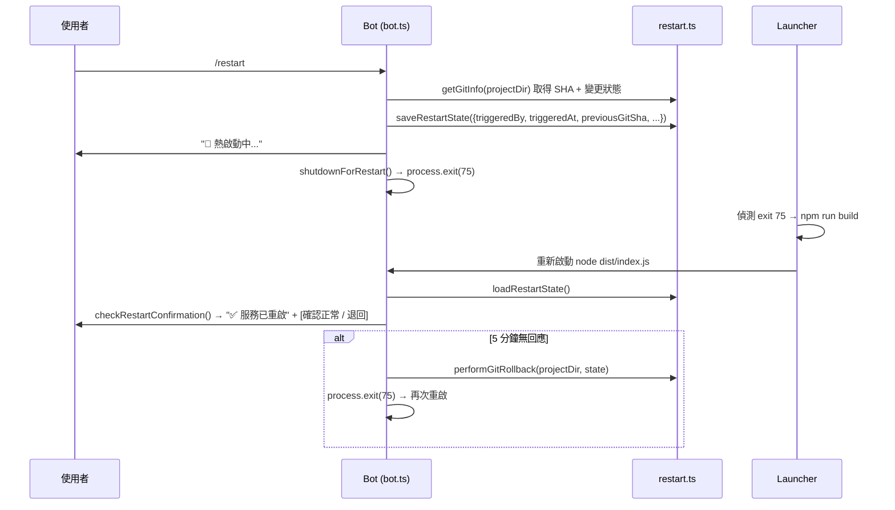

### 14.4 RestartState 型別

```typescript
type RestartState = {
  triggeredBy: "user" | "system"     // 觸發者
  triggeredAt: number                // 觸發時間戳
  previousGitSha: string             // 重啟前的 Git commit SHA
  hadUncommittedChanges: boolean     // 是否有未提交的變更
  rollbackCount: number              // 退版次數
}
```

狀態檔案儲存於 `~/.teletopaz/restart-state.json`，啟動時讀取並清除。

#### restart.ts 匯出函式

| 函式 | 說明 |
|------|------|
| `saveRestartState(state)` | 將 RestartState 序列化寫入 `restart-state.json` |
| `loadRestartState()` | 讀取並反序列化 RestartState，回傳 `RestartState \| null` |
| `clearRestartState()` | 刪除 `restart-state.json` 狀態檔案 |
| `getGitInfo(projectDir)` | 取得當前 Git SHA 與未提交變更狀態 |
| `performGitRollback(projectDir, state)` | 執行 `git reset --hard {previousGitSha}` 退版 |

### 14.5 自動退版機制

| 條件 | 動作 |
|------|------|
| 使用者按「✅ 確認正常」 | `clearRestartState()`，完成 |
| 使用者按「🔙 退回前一版」 | `performGitRollback()` → `saveRestartState({ triggeredBy: "system", rollbackCount + 1 })` → `process.exit(75)` |

#### 5 分鐘逾時處理 (`handleRestartTimeout`)

| 分支 | 條件 | 動作 |
|------|------|------|
| 1 | `triggeredBy === "system"` | `clearRestartState()` → `process.exit(1)` (**不退版**，防止無限循環) |
| 2 | `triggeredBy === "user"` 且 `rollbackCount < 1` | `handleRestartRollback()` → 退版 + `process.exit(75)` |
| 3 | 其他（已退版仍逾時） | `clearRestartState()` → `process.exit(1)` |

### 14.6 package.json 啟動腳本

| 腳本 | 指令 | 說明 |
|------|------|------|
| `npm start` | `node scripts/launcher.js` | 標準啟動（含 Launcher 包裹、支援熱重啟） |
| `npm run start:direct` | `npm run build && node dist/index.js` | 直接啟動（不含 Launcher，`/restart` 會終止程序） |

---

## 16. 版本變更紀錄

| 版本 | 日期 | 變更說明 |
|------|------|----------|
| 0.3.0 | 2026-03-18 | 新增 Claude Code CLI 供應商（`cccli`，`claude-code` ProviderType）；新增 Gemini PTY 工作階段（`gemini/pty-session.ts`，node-pty 驅動）；新增 PTY 模組（`src/pty/`，含 runner/session-manager/ansi-parser/human-typist/sanitizer/request-queue/session-pacer）；`AgentContext` 新增 `sessionVersion`、`silentMode`、`silentAnchorMessageId`、`lastProactiveRebuildNotice` 欄位；新增 `/silent` 安靜模式指令（工具狀態折疊至錨點訊息）；新增 `/router` 指令（以 routerModel 執行單次對話並自動還原）；主動重建通知去重複機制（`lastProactiveRebuildNotice` 編輯計數）；TelegramApi 啟用 Happy Eyeballs；`errors.ts` 新增 "Session not found:" 錯誤處理；模型清單新增 `cccli:claude-opus-4.6`、`cccli:claude-sonnet-4.6`；`CliProviderLabel` 新增 `cccli`；新增 §8 PTY 模組章節；目錄新增至 34 個測試檔案 |
| 0.2.8 | 2026-03-15 | 建構子新增 `startTimestamp` 參數文件；陳舊事件過濾機制說明；圖片附件磁碟儲存路徑文件；Copilot GitHub Token 環境變數解析順序（`COPILOT_GITHUB_TOKEN` → `GH_TOKEN` → `GITHUB_TOKEN`）；`normalizeModelInfos` 欄位解析順序；Gemini `queryProviderInfo()` 靜態回傳值與附件注入格式文件；供應商比較表新增附件/Skills 差異與權限流差異表；語意分析完整列出 12 組繞過短語、18 組動作詞、24 組敏感目標詞；工具權限流程圖拆分為 Copilot 雙層（`onPermissionRequest` + `onPreToolUse`）與 Gemini 單層兩版；新增 §12.7 Skills 系統、§12.8 TempNote 自動建立、§12.9 `stripAttachmentContext` 輔助函式；`checkQuota` 始終放行說明；常數表新增 `APP_ROOT`、`BUNDLED_SKILLS_PATH`、處理中計時器 20 秒延遲；bot.ts 行數更新至 2,723；SDK 解析修正為 `import.meta.resolve`；移除不存在的 protocol v3 宣稱；`composePrompt` 描述修正為路徑描述而非 data URL；補齊 `clearRestartState()` 與完整 restart.ts 函式表；`handleRestartTimeout` 三分支邏輯完整記錄 |
| 0.2.7 | 2026-03-15 | 主動偵測新增靜默時段：00:00–07:59 UTC+8 重建不發送通知（`isQuietHours`）；新增 §6.2.1 通知靜默時段章節；更新 §6.4 流程圖含靜默判斷分支 |
| 0.2.6 | 2026-03-15 | 工具分類表修正（`WRITE_DELETE_TOOLS`/`WRITE_DELETE_KEYWORDS`/`READ_ONLY_TOOLS`/`READ_ONLY_KEYWORDS` 完整列出所有成員）；沙盒 `isSandboxEnabled()` 行為釐清（永遠回傳 `true`，`TELETOPAZ_SANDBOX` 無功能效果）；`/dev/pts` 修正為僅讀取（非可讀寫）；敏感路徑偵測新增 `SECRET_FILE_BASENAME_RE` 與 `TOOL_PATH_KEY_RE` 正則表達式；`evaluateComposedPrompt` 補齊 `ignoreLength`/`skipSemantic` 選項說明；Telegram 型別補齊全部 12 個型別定義；模型設定新增 `CliProviderLabel`/`SupportedModel` 核心型別 |
| 0.2.4 | 2026-03-14 | 補齊 `MIME_EXTENSIONS` 支援格式、`PromptChunks` 型別定義、意圖分類器 `approvalMode`/`APP_ROOT` 細節、`GuardedOutput` 型別與非阻擋輸出 `redactStrict()` 說明、`evaluatePromptWithOptions` 的 `skipSemantic` 選項、`getTelegramHost()` 匯出、`REQUEST_TIMEOUT_MS`/`DOWNLOAD_TIMEOUT_MS` 常數 |
| — | — | *0.2.5 版本號跳過，無此版本* |
| 0.2.3 | 2026-03-14 | GitHub Token 遮蔽模式修正（`ghio_` → `ghr_`，對齊 `gh[opsru]_` 正則）；Gemini 預設 approvalMode 釐清（SDK 預設 `yolo`，bot.ts 傳入 `plan`）；環境變數表新增 `TELETOPAZ_SANDBOX` / `TELETOPAZ_SANDBOX_ACTIVE` |
| 0.2.2 | 2026-03-14 | 修正 RestartState 型別（`sha/chatId/timestamp` → `triggeredBy/triggeredAt/previousGitSha/hadUncommittedChanges/rollbackCount`）；修正內建護欄規則 ID（使用實際 `builtin_*` 前綴）與 KNOWN_TOKEN/PROMPT_INJECTION/SECRET_LEAK 完整清單；AiSession.send() 補齊 `attachments` 參數；沙盒白名單補齊 `.copilot`/`.codex`/dev 節點等路徑、黑名單補齊 `/private/etc/master.passwd`/`/var/db/dslocal`；回調路由表修正 `pick.manual/router/core` 為 `do.model:` 子路由；TLS/Redaction/Models/Secrets/Directories 模組匯出清單勘誤 |
| 0.2.1 | 2026-03-14 | 修正會話韌性時間常數（idle: 15min→1h, lifetime: 60min→10h）；移除不存在的 `start:hot` 腳本；補齊護欄引擎 API（`evaluatePromptWithOptions`, `evaluatePromptIgnoringLength`, `GuardrailDecision`）；補齊 `getIconPool()` 與敏感路徑清單（`.pypirc`, `.netrc`, `.kube`） |
| 0.2.0 | 2026-03-14 | 新增會話韌性與復原機制（被動 / 主動偵測）；新增熱重啟與自動退版（`/restart`）；`npm start` 改用 Launcher 包裹；新增檔案附件支援 |
| 0.1.0 | 2026-03-11 | 初始版本規格文件 |

> 本文件應隨程式碼變更同步更新。每次重大功能新增、API 變更或架構調整時，請在此表新增一行紀錄。
